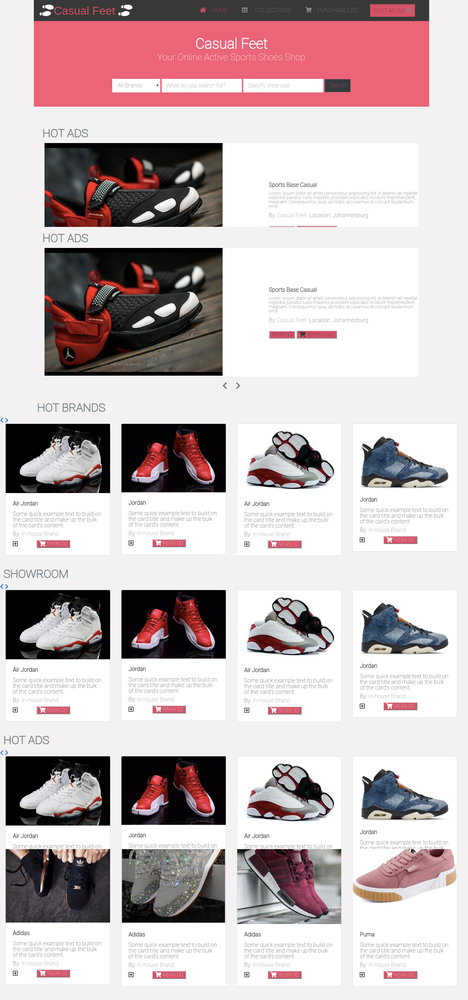
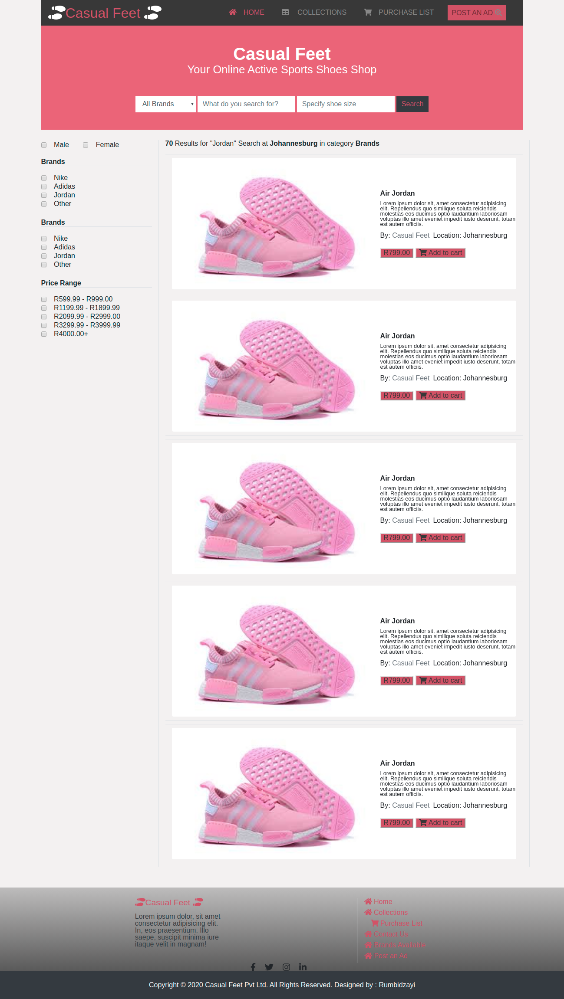
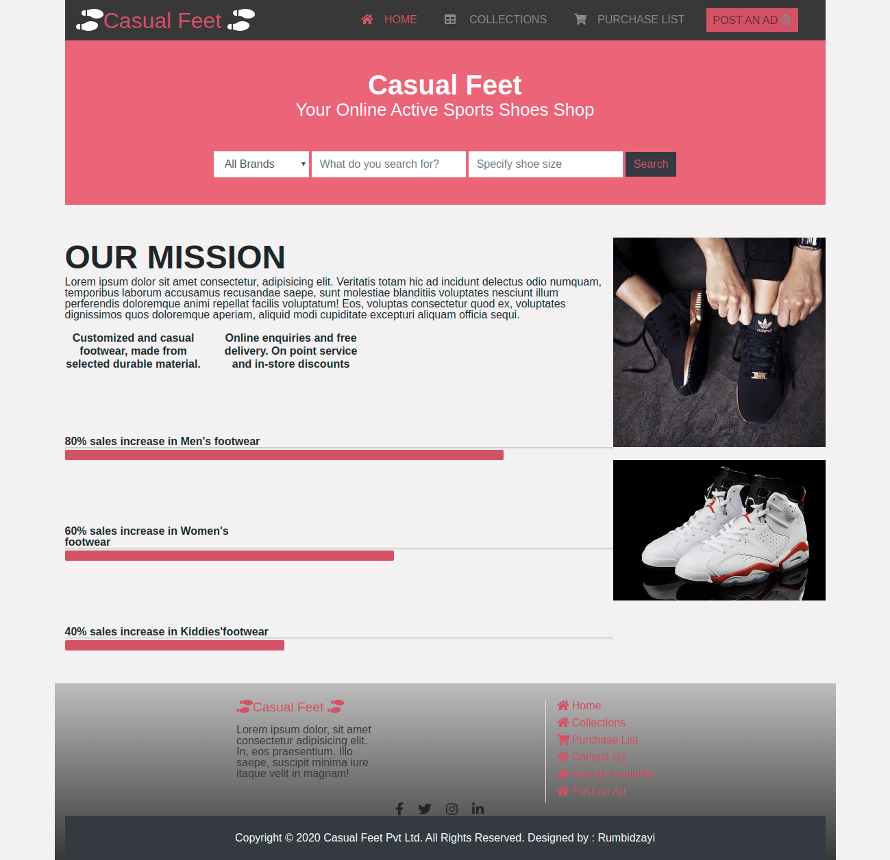

# Capstone-Html-and-Css-Project
The Capstone project is mainly a combined effort of the Html and CSS, not excluding Bootstrap, concepts that have been acquired through the Microverse main HTML and CSS learning curriculum.
UI and UX design skills have been demonstrated in the visual appearance of the site through usage of the Flexbox property and basic layout of each page in the project. The online-shop for electronics project resembles a real-world model of a physical casual shoes retail outlet. This project consists of three pages: 

- Home page(main page)
- Purchase Lists page (about and sales projection page)
- Search Results page (price and item search area)

## Screenshot

## Built With

- HTML
- CSS
- Fontawesome
- Bootstrap
  ​

## Live Demo

​
[Live Demo Link](https://rawcdn.githack.com/Rumbie-Mudzie7/Capstone-Html-and-Css-Project/502b5d4a03b379c65f7779934d8a38b1bd8bed8b/index.html)
​

## Getting Started

​
**Clone the repo on your system, find the index.html file and open with your browser**
​

## Authors
​
#### 👤 **Rumbidzayi MUDZIVIRI**
​
- Github: [@Rumbie-Mudzie7](https://github.com/Rumbie-Mudzie7)
- Twitter: [@RumbidzayiMudz3](https://twitter.com/RumbidzayiMudz3)
- Linkedin: [rumbidzayimudziviri](https://www.linkedin.com/in/rumbidzayi-mudziviri-792b4b85/)​

## Contributing

Contributions, issues and feature requests are welcome!
​
Feel free to check the [issues page](https://github.com/Rumbie-Mudzie7/Capstone-Html-and-Css-Project/issues/1).
​

## Show your support

Please, give a ⭐️ if you like this project!
​

## Acknowledgments

- microverse.org
- Fontawesome
- Our Stand up teams
- Microverse TSE
- ZATTIX Mohammed Awad

  ​
## License
​
This project is [MIT](lic.url) licensed.
